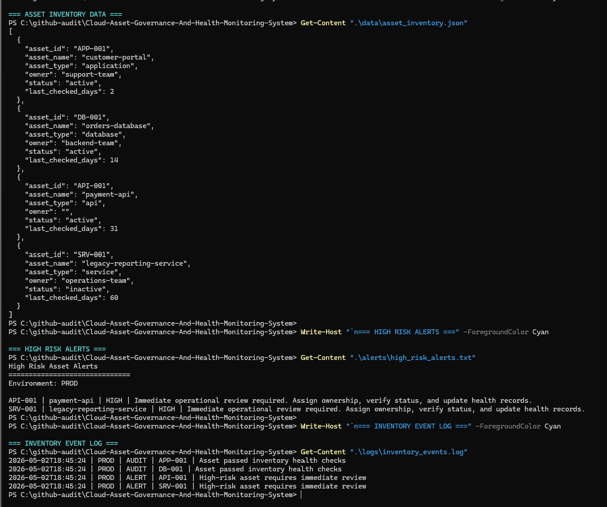
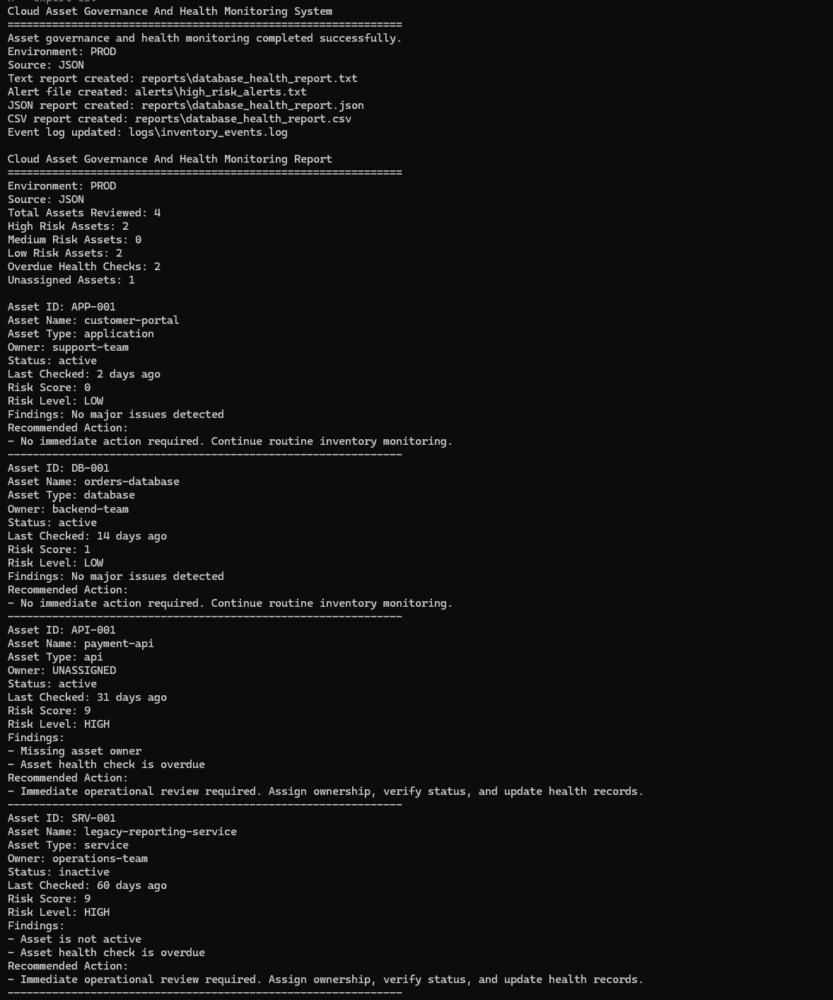

# Cloud Asset Governance And Health Monitoring System

## Overview

This project simulates a cloud operations tool used to review asset inventory records, identify ownership gaps, detect stale health checks, classify operational risk, generate alerts, and export reports for support teams.

It reflects how cloud support teams maintain visibility across applications, databases, APIs, and services in a production-style environment.

---

## Project Objective

To analyze cloud asset inventory records and classify operational risk based on ownership, activity status, asset type, and health-check freshness.

The system focuses on:

- Asset Inventory Review
- Multi-Source Ingest Using JSON And CSV
- Missing Ownership Detection
- Inactive Resource Identification
- Stale Health-Check Detection
- Risk Scoring And Classification
- High-Risk Alert Generation
- Environment-Aware Audit Logging
- Human-Readable, JSON, And CSV Reporting
- API-Style Output For Service-Based Consumption

---

## Simulated Environment

- Cloud Application Environment
- Multiple Asset Types Including Applications, Databases, APIs, And Services
- Inventory Records Stored In JSON And CSV Formats
- Operational Health Review Workflow
- Environment-Specific Reporting And Logging
- Alert Output For High-Risk Assets

---

## Operations Scenario

A cloud support team needs to review asset inventory to identify resources that may create operational risk.

Risk may come from missing ownership, inactive services, outdated health checks, poor asset visibility, unclear operational responsibility, and high-risk databases or APIs requiring closer review.

---

## System Architecture

- Data Layer: JSON And CSV Asset Inventory Records
- Analysis Layer: Inventory Health Checks
- Risk Layer: Risk Scoring And Classification
- Alert Layer: High-Risk Asset Alert Generation
- Logging Layer: Environment-Tagged Audit, Review, And Alert Events
- Reporting Layer: Text, JSON, And CSV Health Reports
- API Output Layer: Console-Based JSON Response For Integration-Style Use

---

## Asset Health Rules

| Check | Rule |
|---|---|
| Ownership | Every Asset Should Have An Assigned Owner |
| Status | Active Assets Are Considered Healthy |
| Health Check Freshness | Assets Should Be Checked Within 30 Days |
| Inactive Asset | Requires Operational Review |
| Database/API Asset | Receives Additional Risk Weighting |

---

## Risk Classification

| Risk Level | Meaning |
|---|---|
| HIGH | Immediate Operational Review Required |
| MEDIUM | Follow-Up Review Recommended |
| LOW | No Immediate Action Required |

---

## Diagnostic Workflow

1. Select Input Source: JSON Or CSV
2. Load Asset Inventory Records
3. Check Ownership Status
4. Check Asset Activity Status
5. Check Health Review Freshness
6. Apply Additional Weighting For Database And API Assets
7. Calculate Risk Score
8. Classify Asset Risk Level
9. Log Audit, Review, Or Alert Events
10. Generate High-Risk Alert File
11. Generate Human-Readable Report
12. Optionally Export JSON And CSV Reports
13. Optionally Print API-Style Output

---

## Output Files

The system generates:

- reports/database_health_report.txt
- alerts/high_risk_alerts.txt
- logs/inventory_events.log

When export options are enabled, it also generates:

- reports/database_health_report.json
- reports/database_health_report.csv

---

## Screenshots

### Inventory Check

### Database Health Report

---

## Project Structure

- data/asset_inventory.json
- data/asset_inventory.csv
- reports/database_health_report.txt
- reports/database_health_report.json
- reports/database_health_report.csv
- alerts/high_risk_alerts.txt
- logs/inventory_events.log
- screenshots/inventory-check.png
- screenshots/database-health-report.png
- inventory_health_checker.py
- README.md
- requirements.txt

---

## Technologies Used

- Python
- JSON
- CSV
- CLI Execution
- Asset Inventory Analysis
- Risk Scoring
- Alert Generation
- Environment-Aware Logging
- Operational Reporting
- API-Style JSON Output

---

## How To Run

Run with default JSON source:

python inventory_health_checker.py

Run production-style review with JSON and CSV exports:

python inventory_health_checker.py --env prod --source json --export-json --export-csv

Run using CSV as the input source:

python inventory_health_checker.py --env prod --source csv --export-json --export-csv

Print API-style JSON output:

python inventory_health_checker.py --env prod --source json --api-output

Then review:

- reports/database_health_report.txt
- reports/database_health_report.json
- reports/database_health_report.csv
- alerts/high_risk_alerts.txt
- logs/inventory_events.log

---

## Planned Enhancements

- Add SQLite Database Storage
- Add Asset Owner Notification Simulation
- Add Dashboard View For Asset Health
- Add Cloud Tagging Policy Checks
- Add Service Dependency Mapping
- Add Scheduled Scan Simulation
- Add REST API Endpoint Using Flask Or FastAPI

---

## Real-World Relevance

This project reflects cloud support and operations responsibilities such as:

- Maintaining Asset Visibility
- Reviewing Database-Style Inventory Records
- Identifying Unowned Or Inactive Resources
- Detecting Stale Health Checks
- Generating High-Risk Alerts
- Supporting Operational Accountability
- Producing Audit-Ready Health Reports
- Exporting Reports For Team Workflows And Downstream Systems

---

## Professional Positioning

This project is designed as an entry-level cloud operations and asset governance simulation.

It demonstrates the ability to review inventory records, detect operational risk, generate alerts, export reports, and communicate asset health clearly.
